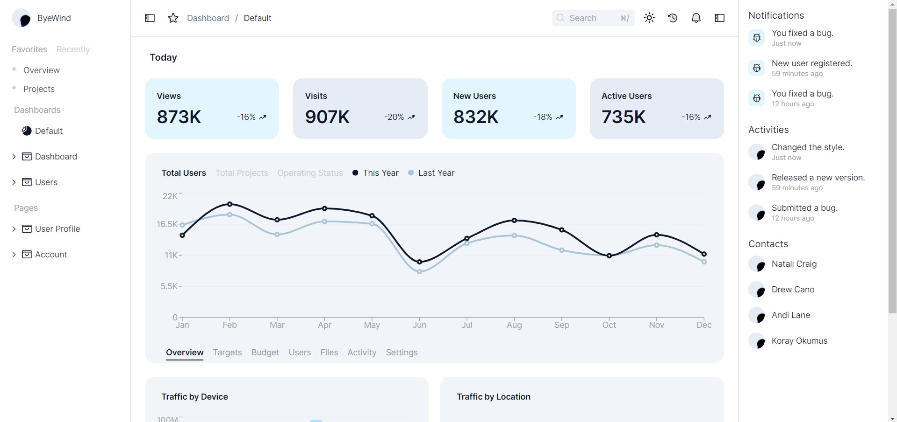

# Next.js + Flask (Python) Backend App

A modern web application utilizing Next.js for the frontend and Flask (Python) for the backend. This app includes user authentication, a dashboard for logged-in users, and a responsive interface.

> **Note:** I have used upstash's redis for auth sessions which is not working atm, that's auth veriication is removed from the codebase, this will be fixed by evening. Thanks
## Features

- User Authentication
- Secure Login System
- Dashboard with User-specific Data
- Responsive UI
- Session Management

## Screenshots

It has support or both light and dark mode..

| Login Page | Dashboard |
| --- | --- |
|  |  |


## Getting Started

### Prerequisites

Ensure you have the following installed:

- [Node.js](https://nodejs.org/en/download/)
- [Docker](https://www.docker.com/)
- [Python](https://www.python.org/downloads/)
- A code editor like [Visual Studio Code](https://code.visualstudio.com/) or [PyCharm](https://www.jetbrains.com/pycharm/)

### Installation

1. Clone the repository:

    ```sh
    git clone https://github.com/shashankdaima/leanmvp.git
    cd leanmvp
    ```

2. Set up the backend:

    ```sh
    cd backend/docker
    docker-compose -f .\compose.prod.yml up                                                       
    ```

3. Set up the frontend:

    ```sh
    cd ../frontend
    npm install
    npm run dev
    ```

### Directory Structure

```
.
├── README.md
├── backend
│   ├── Dockerfile
│   ├── docker
│   │   ├── compose.dev-dependencies-only.yml
│   │   └── compose.prod.yml
│   ├── flask_session
│   │   ├── 2029240f6d1128be89ddc32729463129
│   │   └── a68a9977ef7f3bd57cbd0471fe783fc4
│   ├── requirements.txt
│   └── src
│       ├── __pycache__
│       │   ├── config.cpython-311.pyc
│       │   ├── server.cpython-311.pyc
│       │   └── utils.cpython-311.pyc
│       ├── config.py
│       ├── requirements.txt
│       ├── server.py
│       └── utils.py
├── directory_structure.txt
├── screenshots
│   ├── auth-dark.png
│   ├── dashboard-dark.png
│   ├── dashboard-light.png
│   └── image.png
└── ui
    ├── README.md
    ├── app
    │   ├── (dashboard)
    │   │   ├── @counter
    │   │   │   └── page.tsx
    │   │   ├── @distribution
    │   │   │   └── page.tsx
    │   │   ├── @traffic
    │   │   │   └── page.tsx
    │   │   ├── collapsible-layout.tsx
    │   │   ├── default.tsx
    │   │   ├── layout.tsx
    │   │   └── props.ts
    │   ├── layout.tsx
    │   ├── login
    │   │   ├── layout.tsx
    │   │   └── page.tsx
    │   └── signup
    │       ├── layout.tsx
    │       └── page.tsx
    ├── components
    │   ├── appbar.tsx
    │   ├── icons.tsx
    │   ├── main-nav.tsx
    │   ├── search.tsx
    │   ├── sidepanels
    │   │   ├── left.tsx
    │   │   └── right.tsx
    │   ├── site-header.tsx
    │   ├── tabLayout.tsx
    │   ├── tailwind-indicator.tsx
    │   ├── theme-provider.tsx
    │   ├── theme-toggle.tsx
    │   ├── trafficByDevice.tsx
    │   ├── trafficByLocation.tsx
    │   └── ui
    │       ├── breadcrumb.tsx
    │       ├── button.tsx
    │       ├── checkbox.tsx
    │       ├── collapsibleNavGroup.tsx
    │       ├── input.tsx
    │       ├── label.tsx
    │       ├── sheet.tsx
    │       ├── skeleton.tsx
    │       ├── toast.tsx
    │       ├── toaster.tsx
    │       ├── toggle.tsx
    │       └── use-toast.ts
    ├── components.json
    ├── config
    │   └── site.ts
    ├── lib
    │   ├── dashboardErrorHook.ts
    │   ├── fonts.ts
    │   ├── getDashboardData.ts
    │   ├── rightSidePanelsRawData.ts
    │   └── utils.ts
    ├── next-env.d.ts
    ├── next.config.mjs
    ├── package-lock.json
    ├── package.json
    ├── postcss.config.js
    ├── prettier.config.js
    ├── public
    │   ├── favicon.ico
    │   ├── google.png
    │   ├── next.svg
    │   ├── placeholder.svg
    │   ├── profile.png
    │   ├── signup.png
    │   ├── thirteen.svg
    │   └── vercel.svg
    ├── styles
    │   └── globals.css
    ├── tailwind.config.js
    ├── tsconfig.json
    ├── tsconfig.tsbuildinfo
    └── types
        └── nav.ts
```
Note: This readme will updated in a day, as a lot redutant code needs to be removed. Thanks !!
